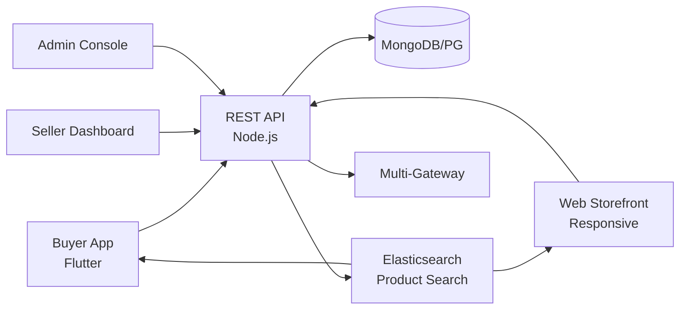

# Weedmaps Clone — White-Label Multi-Vendor E-Commerce Marketplace by Miracuves

**MXDemo** is a production-ready, white-label Weedmaps clone: a complete multi-vendor marketplace with buyer, seller, and admin panels — delivered with **100% source code ownership** in **6 working days**.

> 🛍️ **See it running before you talk to anyone.** Live buyer app, seller dashboard, and admin console — demo credentials are printed on the [solution page](https://miracuves.com/weedmaps-clone#demo). No sales call required.

---

## 🚀 Live Demos

| Environment | URL | What you can test |
|---|---|---|
| 📱 Buyer App | [mas.mimeld.com](https://mas.mimeld.com) | Search, cart, checkout, track order, returns |
| 🌐 Web Storefront | [mxdemo.mimeld.com](https://mxdemo.mimeld.com) | Full shopping experience in the browser |
| 🏪 Seller Dashboard | [Solution page → Demo](https://miracuves.com/weedmaps-clone#demo) | Listings, orders, inventory, analytics, payouts |
| 🛠️ Admin Console | [Solution page → Demo](https://miracuves.com/weedmaps-clone#demo) | Sellers, categories, commissions, fraud, analytics |

Demo credentials for all environments: **[miracuves.com/weedmaps-clone → Demo section](https://miracuves.com/weedmaps-clone/#demo)**

---

## ✨ What Makes This Weedmaps Clone Different

Most e-commerce scripts stop at "catalog + cart." This platform ships with the features that actually run a marketplace *business*:

- **Multi-Vendor Commission Engine** — tiered commissions by category, seller tier, and region — same engine Amazon, Flipkart, and Meesho use for seller tiers
- **COD + Prepaid Unified** — one checkout handles COD, prepaid, wallet, BNPL, EMI — with auto-reconciliation to bank accounts
- **Seller-Built Storefronts** — each seller gets a customisable mini-storefront (logo, theme, banner) within your marketplace — like Flipkart Samarth or Amazon Handmade
- **AI Catalog Moderation** — auto-flag duplicate / NSFW / counterfeit listings before they go live, with human review for appeals
- **Native Logistics Integrations** — plug into Delhivery, Shiprocket, BlueDart, DHL, FedEx — one click for sellers, no API plumbing per carrier

## 📦 Core Features

**Buyer:** search & filters · wishlist · 1-tap reorder · multiple payment methods · order tracking · returns & refunds · loyalty rewards · reviews & ratings · multi-language

**Seller:** product & inventory · order management · bulk listing · promo tools · shipping rules · sales analytics · payout requests · multi-store support

**Admin:** seller onboarding · category management · commission engine · dispute resolution · fraud detection · ad placement · analytics reports

## 🏗️ Architecture

**Stack:** Flutter mobile apps (Android + iOS) · Node.js or Laravel backend · MongoDB or PostgreSQL · Redis for cart & session · Elasticsearch for product search · Stripe, Razorpay, PayPal, COD support, BNPL integrations

## 📋 What’s Included

- ✅ Full source code — backend, web, mobile apps, panels (no encryption, no license locks)
- ✅ Deployment to your servers & app store submission assistance
- ✅ Your branding — white-label rename, logo, colors, domain
- ✅ 60 days post-launch support + 12 months of free updates
- ✅ Documentation & handover

**Pricing:** from **$2,899**, transparent on the [solution page](https://miracuves.com/weedmaps-clone/#pricing) — no "contact us for quote" games.

## 🆚 Why Not Build From Scratch?

Custom e-commerce marketplaces run $80k–$500k and 6–14 months. A proven white-label base gets you to market in 6 working days for a fraction of that, with your budget preserved for seller onboarding and digital marketing.

## 📚 Resources

- 📖 [Weedmaps Clone — Full Solution Page](https://miracuves.com/weedmaps-clone) (features, pricing, demos, FAQ)
- 💰 [How Much Does a Marketplace App Cost in 2026?](https://miracuves.com/weedmaps-clone#pricing) pricing breakdown & what's included
- 📝 [Best Weedmaps Clone Script in 2026](https://miracuves.com/weedmaps-clone/blog/) features, pricing & launch guide
- 🧠 [Multi-Vendor Marketplace Economics: Commission Design](https://miracuves.com/weedmaps-clone/blog/) tiers, take rates, GMV math
- ✅ [Miracuves Facts & Claims Ledger](https://miracuves.com/weedmaps-clone/facts/) every claim we make, verified

## 🏢 About Miracuves

[Miracuves Solutions](https://miracuves.com) builds white-label clone apps and custom software from Mumbai, India — 90+ ready-made solutions, live demos for every product, transparent pricing, and delivery in 6 working days. Operating since 2010.

**Talk to us:** [WhatsApp](https://wa.me/919830009649) · [Schedule a consultation](https://miracuves.com/schedule-consultation/) · [miracuves.com](https://miracuves.com)

---

### ⚠️ Note on This Repository

This repository is a product overview. The full source code is delivered to clients on purchase — see [what’s included](https://miracuves.com/weedmaps-clone/#included). For a hands-on evaluation, use the live demos above; credentials are public on the solution page.

*Keywords: weedmaps clone, weedmaps clone script, ecommerce marketplace, multi-vendor, white label marketplace, online shopping, Flutter ecommerce app, Node.js marketplace*

---

<!--
══════════════════════════════════════════════════
TEMPLATE VARIABLE KEY — auto-generated from Netflix-Clone pattern
══════════════════════════════════════════════════
{APP_NAME}        Weedmaps Clone
{MX_NAME}         MXDemo
{CATEGORY}        Multi-Vendor E-Commerce Marketplace
{DEMO_WEB}        mxdemo.mimeld.com
{PRICE}           $2,899
{SLUG}            weedmaps-clone
{SOLUTION_URL}    https://miracuves.com/weedmaps-clone/
{VERTICAL}        ecommerce

See /tmp/verticals/ecommerce.txt for the vertical config used to generate this README.
══════════════════════════════════════════════════
-->